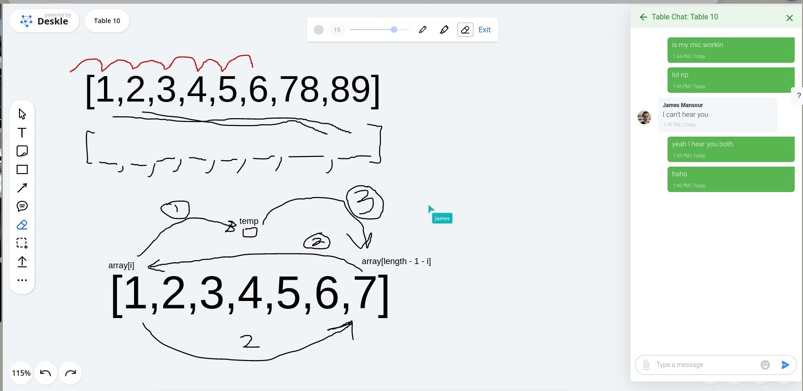
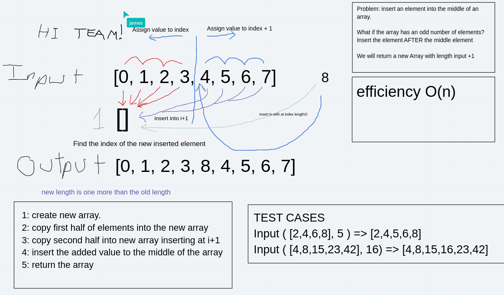
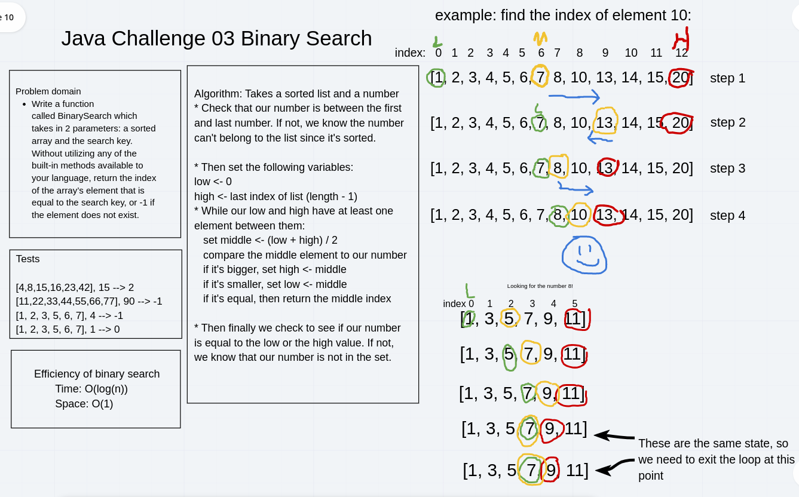

# Reversing an array
The challenge asked us to reverse an array. It gave us the option to either reverse the array in place or create a new reversed array. We came up with solutions to both.

## Challenge

We're being asking to write a method that reverses an array, without using any of the built in methods available that reverse an array.

## Approach & Efficiency

The first approach we took created a new reversed array. The second approach involved swapping elements in place.

The main differences is that the first approach allocates a new array in memory, and thus doubles the amount of memory used. The second approach swaps elements in place by assigning them to a temporary variable. This doesn't require allocating any extra memory.

Regarding time efficiency, both approach take linear time in the length of the array.

## Solution

## Collaborators

This solution was whiteboarded together with my peers [Pablito14](https://github.com/Pablito14), [F0rgiv](https://github.com/F0rgiv), [GoldenDog190](https://github.com/GoldenDog190).

# Inserting an element into an array

Code challenge two asks us to insert an element into the middle of an array.

## Challenge Description

We're writing a method that takes an array and an element, and returns a new array with the element added after the middle index. If the input array has an even number of elements, the new element is inserted right in the middle of the array.

## Approach & Efficiency

We first allocated a new array to hold the result. The length of this new array is the length of the input array plus one.

We then iterated over the original array, copying elements over one by one into the result array. If the index we're copying is less than the index of the inserted element, we kept the index the same, and if the index we're copying is greater than or equal to the index of the new element, we shifted it to the right by one in the new array.

The efficiency of this approach should be linear in time and space, since it loops through the input array exactly once, performing one copy operation for each element.

## Solution

Our [solution code](../challenges/lib/src/main/java/challenges/ArrayShift.java) for this problem.

## Collaborators

This problem was whiteboarded together with Andy Agulue, James Mansour, and Amelia Waggoner.

# Binary search on a sorted array

We are asked to implement a classic binary search algorithm on a sorted array of `int`s.

## Challenge Description

Given a sorted list of `int`s, and a `int` value to look for, determine whether or not that value exists in the array, and if so, return an array index that contains that value.

## Approach & Efficiency

The classic binary search algorithm runs in logarithmic time and constant space, because every iteration of the binary search halves the search space. (Side note: this comes at the cost of having a sorted list. Sorting a list takes at best `O(n log n)` time. If only one query needs to be made on an unsorted array, the sequential search wins out.) This can give considerable gains over sequential search on a sorted list.

## Solution

A link to my [completed code](../challenges/lib/src/main/java/challenges/BinarySearch.java).

## Collaborators

This solution was discussed and whiteboarded with collaborators James Mansour and Amelia Waggoner.
