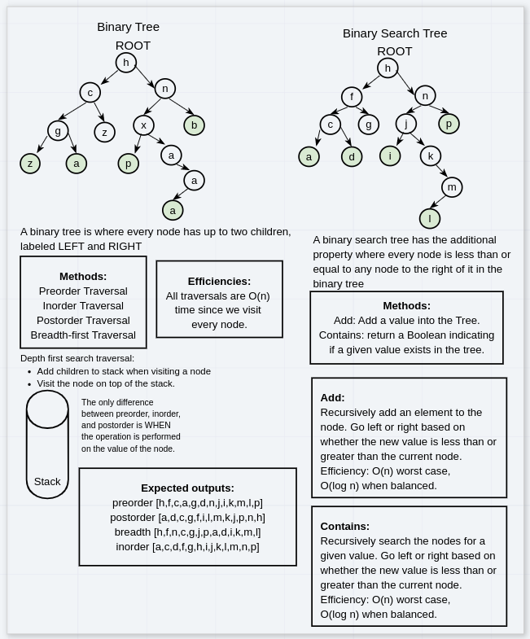
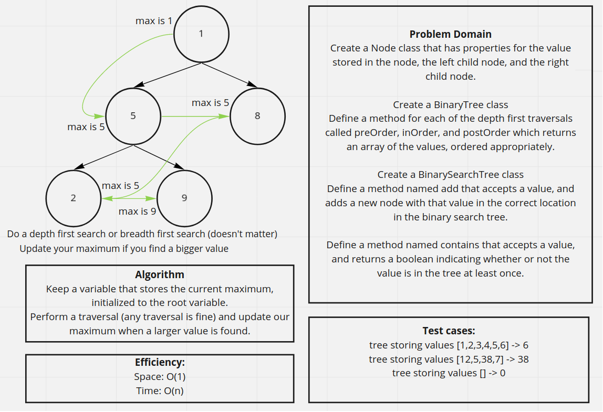
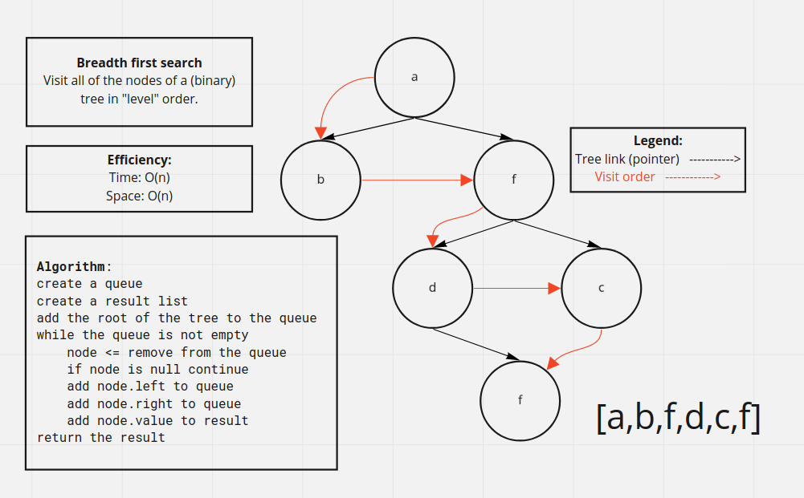
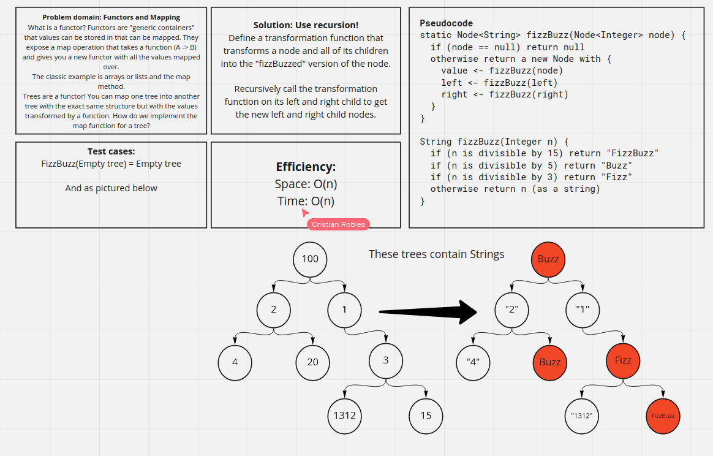

In this series of challenges we're asked to implement various implementations of and algorithms on binary trees.

# Day 15: Binary tree traversals and binary search trees

In this challenge we define a class of binary trees and implement several methods to traverse over the binary tree. Then we extend this class to create a binary search tree, adding `insert()` and `contains()` methods.

The traversals included a breadth first traversal, and preorder, inorder, and postorder depth first traversals. I wrote the traversals in a functional style, taking a method that accepts a value of type `T` as the parameter, and then running that function over each element in the tree.

## Approach

The binary tree class contained only one field, a reference to the root node. The nodes had three fields: a value, a left reference to another node, and a right reference to another node. I defined an iterative solution to each of the traversals. This was actually quite tricky. The breadth first traversal used a queue of nodes to visit. It begins with the root node in the queue, and then while the queue isn't empty, it visits the next node from the queue. When a node is visited, its children are enqueued. The depth-first preorder algorithm had essentially the same shape except instead of a queue, it used a stack to store the nodes to be visited.

The depth-first inorder traversal and the depth-first postorder traversal were more difficult to implement iteratively. The postorder traversal can be expressed as a preorder traversal by flipping all of the left and right nodes in the tree and then processing every element in reverse order. My algorithm for performing the postorder traversal essentially runs a preorder traversal, except visiting the right node before the left node, and then pushing the values into a stack instead of procesing them right away. Then after every value has been pushed into the stack, we pop and process the elements from the stack. The stack essentially reversed the order in which elements are processed.

The inorder traversal algorithm used a stack as well. In this algorithm the stack is used to keep track of nodes that need to be processed and their right child branch visited. We start with a "current node" reference pointing to the root. Then we repeat the steps until all nodes are visited. If our current node has a left child, we push the current node onto the stack, and then we go to the left child. If our current node does not have a left child, then we process its value and then set our current node to its right child. If at any point we reach a node that does not have a left or a right child, we process that value and then pop a value off the stack, and set that to our current node.

The binary search tree was implemented iteratively using the classic algorithms. A value is inserted into a parent on its left if it is less than or equal to the value of the parent, and a value is inserted into a parent on its right if it is greater than the value of its parent. Searching for an element proceeds in the same fashion.

## Efficiency

All of the traversals are necessary `O(n)` time since every node needs to be visited. The binary tree algorithms currently have no provision for balancing the trees, so they can be `O(n)` worst case. For instance, if values are inserted into the tree in sorted order, the tree grows linearly in one direction, which results in the worst case `O(n)` for insertion and search. However if the tree is balanced we have `O(log n)` search and insertion.

## Solution

All of these algorithms can be found in the [BinaryTree](../challenges/lib/src/main/java/challenges/tree/BinaryTree.java) class and the [BinarySearchTree](../challenges/lib/src/main/java/challenges/tree/BinarySearchTree.java) class in my source files.



# Day 16: General folds or reductions on binary trees

In this challenge we're asked to write a method on a binary tree that finds the maximum value in that tree. I generalized this problem to a fold on the tree. A fold (or a reduction) takes a binary function from a result type `S` and the value type `T` of the tree to the result type `S`, and also an initial value of the result type `S` and performs this operation on every value in the tree, passing the result as the input of the next operation. This generalizes a variety of operations we'd like to perform on a collection of items, including taking the sum, product, minimum, maximum.

## Approach

The idea is essentially the exact same as the traversals outlined above. We encode the pattern of applying a binary operation to an accumulator value of the result type to each value in the tree as we visit it. The algorithms are the exact same as in the four traversals above.

## Efficiency

Since every node is visited, the efficiency is necessarily `O(n)`.

## Solution



The code can be found in the same classes as the previous challenge. Of note is that each traversal is overloaded in three different ways:

```
void breadthFirstTraversal(Consumer<? super T> f);
```

This method is analogous to a `forEach` method on a collection, performing a function once for every value in the tree.

```
<S> S breadthFirstTraversal(BiFunction<? super S, T, ? extends S> f, S init);
```

This method is the general `reduce` method with a result type `S` and an initial value of the result type.

```
T breadthFirstTraversal(BinaryOperator<T> f);
```

This method takes a binary operator on values of type `T` and does not take an initial value. This is a `reduce` method where the result type is the same as the value type of the collection and the initial value is taken from the collection itself. This generalizes finding the sum, product, minimum, or maximum of the elements of the tree

# Day 17: Breadth first traversal on a binary tree

This challenge asks us to perform a breadth first traversal on a binary tree.

## Solution

The code can be found in the [BinaryTree](../challenges/lib/src/main/java/challenges/tree/BinaryTree.java) class.



# Day 18: Rose trees (k-ary trees) and fizz buzz

In this challenge we implement a k-ary tree and then create a new tree based on that original tree according to the "fizz buzz" rules.

## Description

We first need to implement a k-ary tree, a tree where a node can have any number of children. Then, we implement a `fizzBuzzTree` method that takes a tree as input and creates a new tree with all of the nodes transformed in some way. This transformation rule is from integers to strings, where numbers divisible by 3 become "Fizz", numbers divisible by 5 become "Buzz", and numbers divisible by both 3 and 5 become "FizzBuzz".

## Approach

### Tree implementation

First we consider the various ways to implement a k-ary tree. Each node needs to have a collection of children nodes, where the collection can vary in size. There are a number of choices for the collection but a reasonable choice is a Linked List.

### Mapping from one tree to another

We are asked to create a new tree from an original tree with the exact same structure, but with some transformation applied to each element. What we're doing is called mapping, and the objects that we can map over are called functors.

What we can do is define a map function on our binary and k-ary tree implementations that allow us to generalize this pattern.

The most straightforward approach is to handle this recursively over the nodes, where mapping a node involves calling the function recursively on its children and then attaching those mapped nodes to the new parent.

Since Java is not a great setting for recursion the iterative approach involves performing a depth first traversal of the original tree and then building a new tree with transformed values as we traverse the first tree.

### Fizz Buzz transformation

There are a number of choices we could make to define the Fizz Buzz transformation. Since Java is statically typed and does not support algebraic types we can't create a tree that stores both numeric and string values without going down to their greatest common type, which would be Object.

My choice is to make the input domain Integer and the output domain String, where we map Integers to Strings if the value is to be unchanged.

## Efficiency

Mapping from one tree to another is necessarily O(n) in time and space, since we need to see every element in the first tree, and also create a new tree with the exact same number of elements.

## Solution

I went with the recursive definition of map on tree nodes for both the binary tree and the k-ary tree.
The code can be found in the [RoseTree](../challenges/lib/src/main/java/challenges/tree/RoseTree.java) class.


