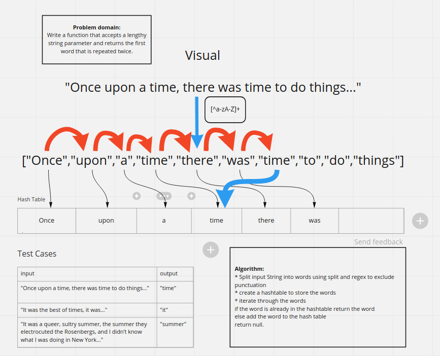

# Hash-based data structures

Hash tables describe a way of storing data based on hash functions that exhibit efficient add, update, lookup, and
delete operations. In this series of challenges we implement hash-based data structures and use them to solve various
solutions.

# Class 30: Hash Table Implementation

We implement a hash map using separate chaining (using a linked list to store nodes with the same hash index). The
HashMap implements a map, which accepts values of a certain type associated with keys of another type. Each key is
associated with a value and the value for a given key can be added, updated, or removed. The hash map implements a map
by storing key-value pairs in an indexed array, and using a hash function to determine the array index for a given key.

## The Challenge

In the `Map` interface I define the API of the data structure and in the `HashTableSeparateChaining` class I define the
implementation. The type of hash map I implemented is called a hash map with separate chaining, which uses a linked list
at each array index to store the key-value pairs that are associated with that index.

## Approach

My `HashTableSeparateChaining<K, V>` class stores an array of `Object`, since Java doesn't support arrays of a specified
generic type. The array stores values of type `EntryNode<K,V>`, which has three properties: a `key` of type `K`,
a `value` of type `V`, and a `next` reference to the next node in the linked list. This way I didn't have to perform any
initialization, since the default `null` value of an Object array represents a hash index without any values.
Implementing the `add`, `contains`, `remove` and `get` methods just used the basic logic of singly-linked lists, which
we've covered before in detail. The hash index was chosen by taking the `.hashCode()` value of a key modulo the size of
the array.

I also chose to implement a hash table that scaled up and scaled down the size of its underlying array when the number
of entries stored changes. This is similar to the way a dynamic array is implemented. When the number of entries reaches
a certain proportion of the capacity of the underlying array, a new larger array is allocated and the entries from the
first array are rehashed and inserted into the larger array.

## Efficiency

A Hash Table has constant time or near-constant time operations for insertion, update, lookup, and deletion. This is
because it uses hashing and array indexing to find its elements, which are both O(1) operations. However, since the
array actually holds pointers to the head of linked lists, the operations can take O(m) where `m` is the length of the
linked list at an index. Thus care needs to be taken that the number of entries in a hash map doesn't exceed the
capacity of the array by a large factor, since this will guarantee that each linked list has multiple nodes.

To address this issue, we need to ensure that the load factor (the ratio between the number of entries and the size of
the array) doesn't exceed a certain value, and when it does, we allocate a new array, iterate through the original, and
rehash the entries into the new array. Although this resizing is an O(n) operation, as long as the size of the array is
being increased by a constant factor and the threshold for increasing the size of the array is a constant proportion of
the capacity, the running time for the operations is an amortized O(1). This is similar to resizing a dynamic array.

The choice of factors for the thresholds and the expansion and contractions is a tradeoff between space and time, where
choosing larger factors results in faster operations but more wasted space. I choose values for the thresholds at which
resizing happens and the factors that the array is expanded or contracted by:

```java
// When the load factor exceeds the expansion threshold, the hash table is expanded
static final double EXPANSION_THRESHOLD=0.8;
// The proportion that the size of the underlying buckets array is increased by during expansion
static final double EXPANSION_FACTOR=1.5;
// When the load factor drops below the expansion threshold, the hash table is contracted
static final double CONTRACTION_THRESHOLD=0.2;
// An factor that the size hash table is decreased by during contraction;
static final double CONTRACTION_FACTOR=0.67;
// The default capacity of the hash table if no initial capacity is given
static final int DEFAULT_CAPACITY=11;
```

## API

The API is documented in the [`Map` interface file](../challenges/lib/src/main/java/challenges/hashTable/Map.java). The
implementation can be found in
the [`HashTableSeparateChaining` class](../challenges/lib/src/main/java/challenges/hashTable/HashTableSeparateChaining.java)
.

# Class 30 bonus: Hash Table with Linear Probing Implementation

I also implemented a hash table that uses linear probing to handle collisions rather than separate chaining. This means
that key-value pairs are stored directly in the array, and when a collision is detected on an `add` operation, the
key-value pair is inserted at the next available array index.

Lookup involves checking the hash index and every subsequent index until a null value is found. However, removal is
somewhat complicated by the need to maintain the invariant that every key-value pair is stored in a contiguous block of
non-null elements starting from its hash index. This means that when an element is removed, we continue to iterate
through the subsequent pairs, moving elements into the empty slot when needed.

## API

The API is the exact same as above as both hash table implementations implement the map interface that I defined.

## Testing

Since I only want to test the public interface of my hash table implementations, I wrote tests on the map interface that
they both implement. These tests were written into an abstract class that expects a `getInstance()` method to be
implemented that creates a new instance of a hash map, and also a `getKeys()` and a `getValues()` method that return
lists with test data in them. This way a new implementation of the map interface can be tested against the same set of
tests by implementing the `MapTest` abstract class.

# Class 31: Counting Word Frequency

The challenge involves performing a number of tasks related to word frequency in a text.

## Challenge

The first problem was to write a method that returns the first duplicated word in a string. Then the second challenge
was to write a method that counts the frequencies of the words in a String. Finally, the last method returns the `k`
most commonly used words in a String.

## Approach

To find the first duplicated word, I used a `HashSet` to store all the occurrences of each word. When a word is
encountered, if it already exists in the `HashSet`, we return the word, and if it doesn't, we add it to the `HashSet`.
This algorithm runs in O(n) time, which is also the best conceivable runtime since every token needs to be read in order
to determine if it's the first duplicate.

The String needs to be split up into words in order to perform the basic logic of the algorithm. I did this by using
the `Pattern.compile(regex).splitAsStream(string)` method to split up a String into a stream of substrings split up by
delimiters that match the given regex pattern.

If one were processing extremely large input sizes, the input could not be stored inside a String. Then you'd have to
consider the way that the input was processed and tokenized. Likely you would use some sort of `Stream` interface as
well as a `Tokenizer` that read one word at a time from the input stream. This would reduce the memory usage from O(n)
to O(m), where m is the number of unique words in the text.

The second challenge involved counting the word frequencies in a text. I did this by "tokenizing" the input and keeping
a count for each word seen so far in a HashMap. However, for storing relatively short words, a trie (prefix tree) may be
a better candidate, especially since keys can be found in lexicographical order. This is an O(n) time operation, which
is also the best conceivable runtime.

The third problem involved determining top `k` most frequently used words in a text. My solution counted the word
frequency, then sorted the `EntrySet` by value and returned the first `k` values in a list. However, this is far from
optimal, requiring a costly O(m log m) sorting operation on the entries of the map, where `m` is the number of unique
words in the text. We can in fact come up with a O(m log k) algorithm by keeping the best `k` items seen so far in a
binary search tree that stores `k` items. Each update to the binary search tree can involve an insertion, or a removal
and insertion, which are both O(log k) operations.

## Top `k` from a collection

The problem of getting the top `k` elements in sorted order from an unsorted collection of numbers of size `n` can be
done in O(n log k) time. A simple way to do this involves using a data structure called a priority queue, which allows
us to insert values with a numeric or comparable key in O(log k) or O(1) time, depending on implementation, finding the
minimum key in O(1) time, and removing the minimum key from the data structure in O(log k) time. We create a priority
queue that can store k elements. Then iterate through the collection and insert elements into the priority queue until
it's filled with k elements. Then we compare each subsequent element with the least element in the priority queue, and
if it's greater than the least element, we pop it and insert the new element into the priority queue.

If the collection is streamed, we only need to store the data structure with our top `k` elements. Thus, we only need O(
k) memory for this algorithm.

## Top `k` from an array

If we don't need the `k` elements in sorted order, we can actually get the top `k` elements from an array in O(n) time
by reordering the array in place using an algorithm similar to the quicksort algorithm.

We use the partition algorithm to find a random pivot and move the array elements less than the pivot to the left, and
all the elements greater than the pivot to the right. If there are more than `k` elements to the right of the pivot, we
call partition on the right side of the pivot, and if there are fewer than `k` elements to the right of the pivot, we
call partition on the left side of the array. If there are exactly `k` elements to the right of the pivot including the
pivot itself, we're done, and we return the last `k` elements in unsorted order.

This algorithm actually runs in O(n) expected time. The algorithm is analogous to a binary search, where every step we
are splitting our search space in half. However, in this case performing the splitting step runs in O(n) where n is the
size of the search space remaining. search space. This results in a O(n) algorithm (since 1 + 1/2 + 1/4 + 1/8 + ... = 1)
. Like quicksort, this is only O(1) expected time, and the worst case time can be O(n^2). We achieve closer to the
expected time when a random pivot is used.

## Solution code



The solution code can be found in
the [WordFrequencyCounterTest](../challenges/lib/src/main/java/challenges/utilities/WordFrequencyCounter.java) class.

# Day 32: Intersection of two binary trees

Our problem asks us to write a method that takes two binary trees and returns a set containing items that occur in both
binary trees.

## Challenge

The method takes two binary trees, as defined in our `tree` package. It returns a set that contains all elements in
common between both binary trees.

## Approach

The approach is to collect all the elements from the first tree into a HashSet. Then initialize an empty set for the
result. Then for each element in the second tree, if it's contained in the first set, we add it to the result set.

In order to collect the elements from the first tree into a HashSet, we implemented the `Iterable` interface in
our `BinaryTree` class. The `iterator()` method creates a `BinaryTreeIterator` that internally keeps a LinkedList of
nodes, representing a breadth first traversal. Every time the `.next()` method is called on the iterator, we dequeue an
element from the LinkedList, enqueue its children into the LinkedList, and then return the value of that element.

Defining the `iterator()` method actually also allows us to have a default `forEach` and `spliterator` method.

## Efficiency

First we collect the first tree into a HashSet. This takes O(n) where n is the size of the first tree, and hash sets
have O(1) insertion. Then we iterate through the second hash set, and for each element, we perform a contains check on
the first hash set, and then if true, we perform an insertion into the second hashset. Contains and insertion are both
O(1) operations, so this second stage takes O(m) elements, where m is the number of elements in the second tree. Or in
other words, this is an O(n) operation where n is the number of elements contained in both trees.

## Solution

The solution is as follows:

```java
static public<T> Set<T> treeIntersection(BinaryTree<T> first,BinaryTree<T> second){
        Set<T> firstSet=new HashSet<>(first.breadthFirstEnumeration());
        return StreamSupport.stream(second.spliterator(),false)
        .filter(firstSet::contains).collect(Collectors.toSet());
        }
```

Alternatively instead of using teh stream interface we do a `forEach:`

```java
static public<T> Set<T> treeIntersection(BinaryTree<T> first,BinaryTree<T> second){
        Set<T> firstSet = new HashSet<>(first.breadthFirstEnumeration());
        Set<T> result = new HashSet<>();
        second.forEach(t -> { if(firstSet.contains(t)) result.add(t); })
        return result;
        }
```

No whiteboard for this problem. The solution doesn't care about the fact that the inputs are binary trees. The inputs
can be any iterable collection.

# Day 33: Combining two hash maps with a "Left Join"

The challenge asks us to combine two hash maps into a data structure that mimics a left join operation from SQL.

## Challenge

The method will take two maps, a map from `T -> A` and a map from `T -> B`. The method will return a map
from `T -> Pair<A, B>`. Since Java doesn't have tuple types, we implement a `Pair` class.

## Approach

A result map is initialized with the correct type `Map<T, Pair<A,B>>`. We need to iterate through one map, checking to
see if the key is contained in the second map. If so, a new entry is added to the result map with key `k` and
value `new Pair(a, b)`, where `a` is the value of key `k` in the first map, and `b` is the value of key `k` in the
second map.

## Efficiency

Since we need to iterate through one entire map, the running time is O(n) where n is the size of whichever map is
smallest, since the operations `containsKey` and `put` are O(1) operations (theoretically.)

## Solution:

```java
static public <T, A, B> Map<T, Pair<A,B>> leftJoin(Map<T, A> map1, Map<T,B> map2) {
        Map<T, Pair<A,B>> result = new HashMap<>();

        map1.forEach((k, va) -> {
            B vb = map2.get(k);
            if (vb != null) result.put(k, new Pair<>(va, vb));
        });

        return result;
        }
```

No whiteboard is provided for this problem.