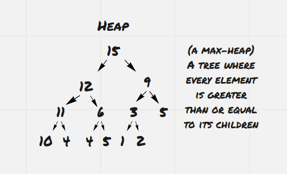
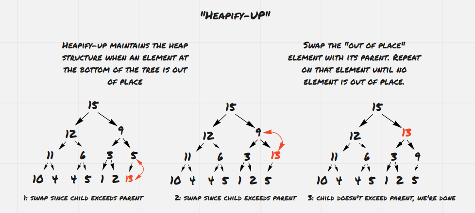
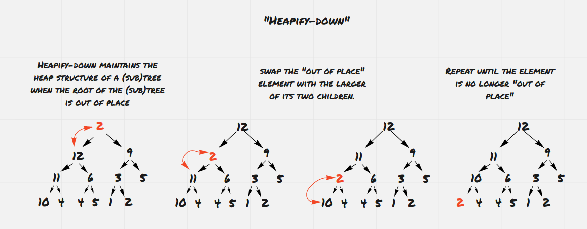
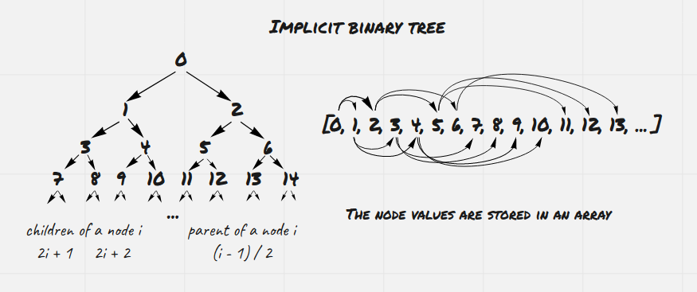

# What's a heap?

A heap describes a way of structuring data in a tree. We can think of heaps by analogy with a binary search tree. In a binary search tree, every element on the left of a node is less than or equal to that node. In a heap, every child of a node is less than or equal to that node.

Here we've pictured a heap (in this case, a max-heap) where every element does not exceed its parent. The heap that we've pictured is a complete binary tree. We'll be using complete binary trees to implement our heap-sort algorithm but as it turns out heaps do not need to be binary trees. Not only that, a heap can consist of multiple trees, as in the [Fibonacci heap][fib-heap] or the [binomial heap][binom-heap].

A tree (or forest of trees) satisfies the max-heap property if every child has a lesser or equal value to its parent. Similarly we say a tree satisfies the min-heap property if every child is greater or equal to its parent. In this case we'll be using max-heaps, so whenever we say the "heap property" we're referring to the max-heap property.

# Basic operations on heaps

Suppose we have a heap, but then we add an element to the bottom of the tree that violates the heap property. How can we modify the tree so that it satisfies the heap property? What if we change the top element so that it no longer satisfies the heap property? We'll introduce two basic heap operations that maintain the heap property when either a top element or a bottom element violates the heap property.

## Heapify-up

When an element at the bottom of the tree is greater than its parent, that element violates the heap property. We call _heapify-up_, sometimes referred to as _bubble-up_ or _sift-up_, to fix our heap. When we call heapify-up on a node, we compare the element at that node with its parent. If the element is less than or equal to its parent, we're done. If that element is greater than its parent, we'll swap the element and its parent, and then call heapify-up on the parent node.

This recursively swaps elements while moving up the tree, restoring the heap property to the tree. Note that this operation assumes that there's only one "out-of-place" element, the node that it's called on. This operation fails when more than one element is out of place in the tree. Later we'll look at an operation that restores the heap property to a tree where many nodes violate the heap property.

Since this operation starts at a node and goes up one level of the tree on each recursive call, its running time is bounded by the number of levels of the tree. In a complete binary tree, our run time for heapify-up is ![O(log n)][o-logn].

## Heapify-down

When an element at the top of a tree is less than either of its children, that element violates the heap property. We call _heapify-down_ (sometimes called _bubble-down_ or _sift-down_) to fix the subtree rooted at the element.

The idea is similar to heapify-up. We want to check whether a node satisfies the heap property, and if not, swap that value with one of its children. However, each node has multiple children. When we swap a value with its child, we want to swap that value with the greater of its children, otherwise we would still be violating the heap property. This means that there is an extra comparison on each step of the algorithm.

Again our run time is ![O(log n)][o-logn] on a complete binary tree since our steps are limited by the number of levels of the tree.

Similarly to heapify-up, this operation only works when the only out-of-order element is at the top of a tree (or a subtree). In other words, heapify-down only ensures that a tree satisfies the heap property if every subtree below the root already satisfied the heap property. If we call heapify-down on a node, it guarantees that the subtree rooted at that node will satisfy the heap property, as long as every subtree below that node already satisfied the heap property. This point will be important when we discuss the _make-heap_ operation below.

## Add-element

To add an value to our heap, we simply create a node at the bottom of the tree, and call heapify-up on that element to ensure the heap property is met.

## Find-max

This operation is trivial if we keep a pointer to the root of the tree, since the root of our heap will always contain the maximum value.

## Remove-max

Removing the maximum element of the tree is similar to the heapify-down operation. We can think of replacing the root of the tree with a "hole" that is less than every possible value, and then calling heapify-down on that hole. At every step of the algorithm, we swap the hole with the greater of its children. This operation is also a ![O(log n)][o-logn] operation since we're limited by the depth of the tree.

## Remove-max-and-add-element

This can be implement by replacing the root of the tree with our new element and then calling heapify-down.

# Turning our heap into heap-sort

With these basic operations, we can already implement a sorting algorithm that uses a binary heap. If we take a collection of `n` elements, insert each of them into a new min-heap, we can create a heap that contains all the elements of our collection. Then, we can remove the minimum element from our heap and insert that into a new list repeatedly until we've populated our sorted list. Since each of these basic operations are ![O(log n)][o-logn], this results in a ![O(n log n)][o-nlogn] algorithm for sorting, which as we found out is asymptotically optimal.

However, we can optimize this basic idea further.

## Implicit binary trees

Consider the representation of our binary tree. The classic representation of a tree as nodes that point to other nodes creates a lot of space and time overhead in storing and following pointers. Also since the nodes are stored anywhere in memory, our program is slower since not all of the data will be available to our CPU cache, causing cache misses.

The design of our operations ensures that our heap is always a complete binary tree, where every level of the tree is filled except for the last level, which is filled in from the left. This means that we can efficiently represent our tree as an array, in what we call an implicit binary tree.

The idea is that nodes are indexed with the root starting at zero, and the children of node `i` are found at indices `2*i + 1` and `2*i + 2`. Since our tree is complete, every index of our array with be filled until a certain point, and there will be no "holes" in our array. This representation allows us to find children and parents of a node with simple arithmetic, instead of costly pointer operations, and keeps all of the values in a continuous block of memory.

## A better make-heap operation

We talked about turning an unordered collection of elements into a heap by repeated insertion into an empty heap. Since we'd be inserting `n` elements, and our `add-element` operation takes ![O(log n)][o-logn] time, this gives us an ![O(n log n)][o-nlogn] time for our `make-heap` operation, while allocating ![O(n)][o-logn] additional space for our heap.

However we can do better. We can actually turn an array into a heap in place without having to allocate the memory for a new heap, if we use our array to present our heap as an implicit binary tree. The way we do this is by calling heapify-down on every element. Since calling heapify-down on an element requires that every subtree beneath it is already a heap, we need to start from the bottom of the tree and work our way up. This ensures that the requirements for heapify-down are met each time we call it, and after we call heapify-down on the root of the tree, the tree satisfies the heap property.

At first glance it seems like this operation runs in ![O(n log n)][o-nlogn] time since we're calling heapify-down on every element of the tree and heapify-down runs in ![O(log n)][o-logn] time. However, if we heapify-down at the bottom of the tree, we can't do any swaps since that element has no children. If we call heapify-down one level up from the bottom, we can do at most one swap (and thus at most two comparisons) since it's only one level up from the bottom. In general, heapify-down is limited by the distance between a node and the bottom of the tree. Complete binary trees are bottom-heavy, and in fact the average distance from a node to the bottom of the tree is a constant that doesn't grow with the size of the tree. Thus our make-heap algorithm actually runs in-place in ![O(n)][o-n] time.

## Getting a sorted array from a heap

Now we just need to produce a sorted array from our heap. We can also complete this last step in place, without allocating a new array.

We start with our heap occupying our whole array from indices `[0..n-1]`. Then, we swap the the first and last values from our array. This ensures that the largest element from our heap is at the end of our array. However, our first element now violates the heap property.

We then imagine that our heap occupies the sub-array from indices `[0..n-2]`, and perform a heapify-down on that sub-array to restore the heap property. Then we can repeat the algorithm on this sub-array, shrinking out sub-array with each step until all of the elements are sorted.

# Putting it all together

## Pseudocode

## Code

[fib-heap]: https://en.wikipedia.org/wiki/Fibonacci_heap
[binomial-heap]: https://en.wikipedia.org/wiki/Binomial_heap
[o-constant]: https://render.githubusercontent.com/render/math?math=\vspace{4pt}O(1) "O(1)"
[o-logn]: https://render.githubusercontent.com/render/math?math=\vspace{4pt}O(\log%20n) "O(log n)"
[o-nlogn]: https://render.githubusercontent.com/render/math?math=\vspace{4pt}O(n\log%20n) "O(n log n)"
[o-n]: https://render.githubusercontent.com/render/math?math=\vspace{4pt}O(n) "O(n)"
