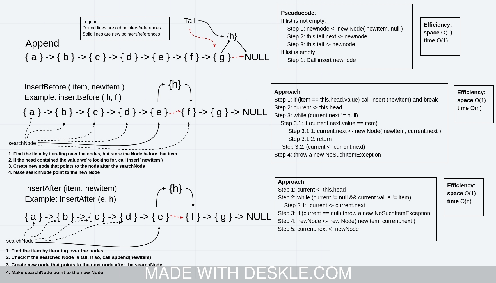

# Singly Linked List

We implement a LinkedList class in our linkedList package. Our linked list needs to support just three operations: `insert`, which adds an element to the beginning of the list, `includes`, which returns whether or not an element is contained in the linked list, and `toString`, which formats a linked list into a string.

## Challenge

The `LinkedList<T>` class consists of three properties, `Node<T> head`, `Node<T> tail`, and `int numElements`. The `Node<T>` object contains a value `item` of type `T` and a (nullable) reference to another `Node<T>` object. Constructing a new LinkedList just creates a new LinkedList object with the `head` and `tail` property initialized to `null`, and the `numElements` initialized to 0.

Adding elements to the linked list involves creating a new node with the new value which points to the current value of `head`. If there are no elements in the list current, the tail also needs to be updated to point to the head.

The includes method checks to see whether or not an item is in the list. This is implemented using a simple while loop through the nodes, iterating by going to the next node. If the current node's item is the item we're looking for, return `true`, and if the next node is `null` (meaning we've reached the end of the list), return `false.`

Finally, `toString` was implemented by iterating through the nodes while adding strings to a StringBuilder.

The `get` method gets the value at the `i`th index in the linked list, indexed starting from `0`. This can be done with a simple for loop, iterating from the current to the next node `i` times. Since we're maintaining a `numElements` property that counts the number of nodes in the list, we can perform bounds checks at the beginning of the method instead of instead the loop.

The `getFromEnd` gets the value at the `i`th value from the end. We can do this by calling `get(numElements - k - 1)`, and since the `get` method is performing bounds checks for us, we can simply let the `IndexOutOfBoundsException` bubble up to the `getFromEnd` method.

## Approach & Efficiency

The efficiency of insertion is `O(1)` since it just requires initializing a node and changing a pointer. Removal from the beginning is also `O(1)` since it requires a single pointer update.

The efficiency of appending an element to the end is also `O(1)` since we maintain a pointer to the last element. However removal from the end requires a full traversal of the linked list to update the `next` pointer of the second-to-last element, and thus is an `O(n)` operation.

The efficiency of the search method `.includes` is `O(n)` in the number of elements, since we are constrained to a linear search by the data structure. The `get` and `set` methods are also `O(n)` in general, since they require traversing the list.

The efficiency of the `toString` method is also `O(n)` since we have to go through the entire list to display every element.

For the `insertBeforeFirstOccurrence` and `insertAfterFirstOccurrence` and `deleteFirstOccurrence` methods, we implement a linear search through the linked list and performed the necessary pointer updates. Cases that had to checked for were inserting at the very beginning or end of the list, where we needed to update the head or tail pointer. Since a linear search is required, the algorithm runs in `O(n)` time.



## API

```java
LinkedList() // O(1): constructor takes no arguments

boolean isEmpty() // O(1): Returns whether or not the list is empty

int size() // O(1): Returns the number of elements in the list

void insert(T item) // O(1): Inserts an item into the start of the list

void insert(Iterable<T> items)
  // O(m): Inserts m items into the start of the list.

void append(T item) // O(1): Inserts an item at the end of the list

void append(Iterable<T> items)
  // O(m): Appends m items at the end of the list

void insertAfterFirstOccurrence(T find, T item) throws NoSuchElementException
  // O(n) Inserts the item after the first element found with value find.
  // If no value is found, throws a NoSuchElementException

void insertBeforeFirstOccurrence(T find, T item) throws NoSuchElementException
  // O(n) Inserts the item just before the first element with a given value "find"
  // If no value is found, throws a NoSuchElementException

void deleteFirstOccurrence(T item) throws NoSuchElementException
  // O(n) Deletes the first occurrence of an item from the list
  // If no value is found, throws a NoSuchElementException

T pop() throws NoSuchElementException
  // O(1): Removes an item from the start of the list and returns it
  // If that item does not exist, throws a NoSuchElementException

T removeFromEnd() throws NoSuchElementException
  // O(n): Removes an item from the end of the list and returns it
  // If that item does not exist, throws a NoSuchElementException

void set(int index, T item) throws IndexOutOfBoundsException
  // O(n): Sets the value of the item at the given index

T get(int index) throws IndexOutOfBoundsException
  // O(n): Retrieves the value of the item at the given index

T getFromEnd(int index) throws IndexOutOfBoundsException
  // O(n): Retrieves the value of the item at the index, counting from the end.
  // For example, getFromEnd(0) would return the last element in the list.

boolean includes(T item)
  // O(n): Returns whether or not the item is contained in the list

String toString()
  // O(n): Formats a list in a string format "{ 1 } -> { 2 } -> { 3 } -> NULL"

void clear() // O(1): Removes all elements from the list
```
