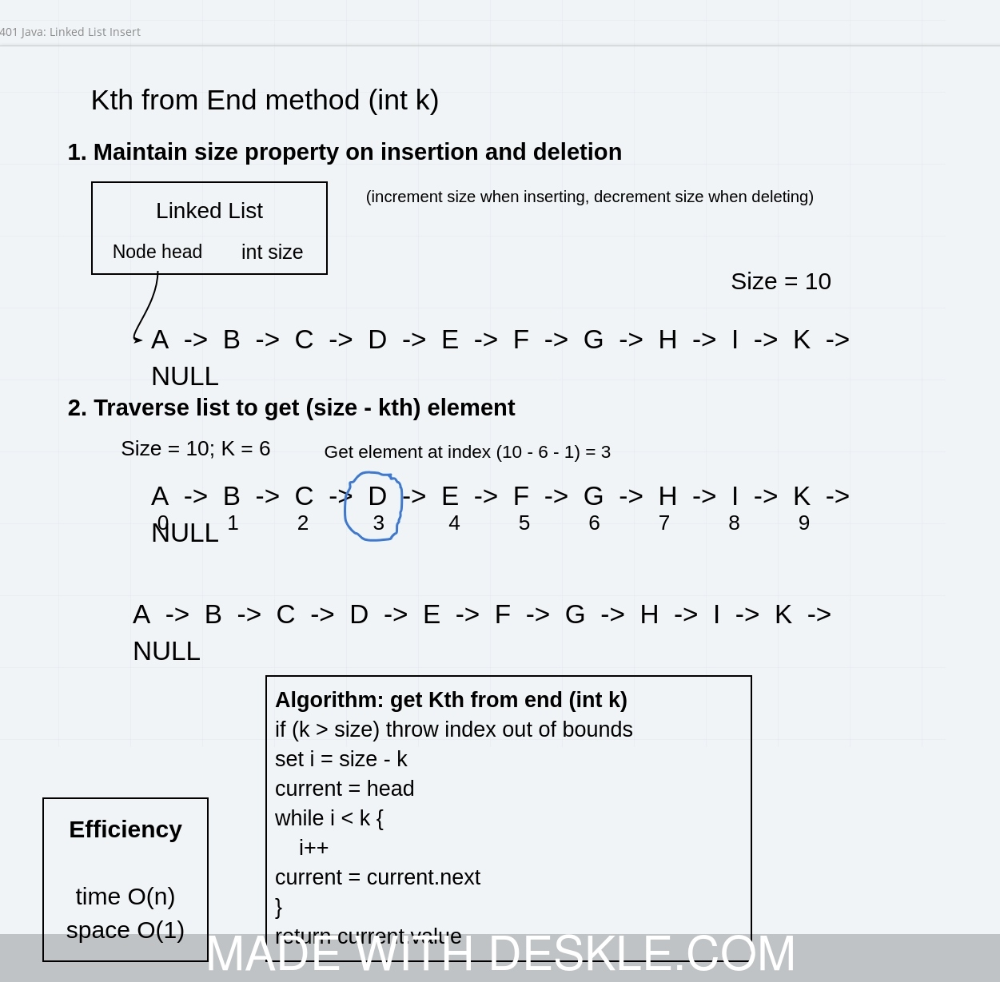
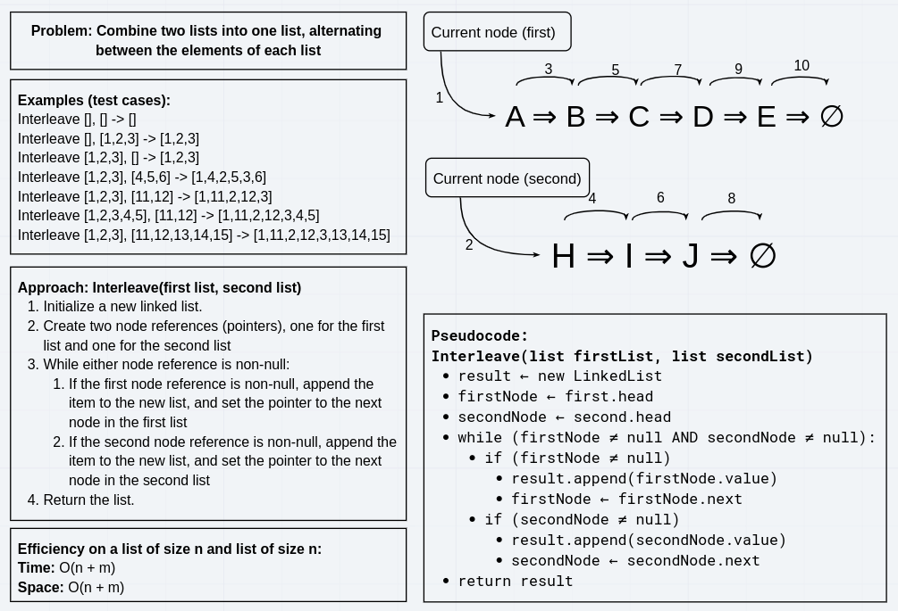

# Singly Linked List

We implement a LinkedList class in our linkedList package. We begin with basic functionality and over the course of
several labs we fill out the API by writing more methods.

# Overall structure

We create a generic `LinkedList<T>` class and a private generic `Node<T>` class to build the structure of our linked
list. The `LinkedList<T>` class consists of three properties, `Node<T> head`, `Node<T> tail`, and
`int numElements`. The head and the tail point to the first and the last elements in the list, respectively, and
the `numElements` counts the number of elements in our list. The `Node<T>` object contains a value `item` of type `T`
and a (possibly null) reference to another `Node<T>` object. Constructing a new LinkedList creates a new LinkedList
object with the `head` and `tail` property initialized to `null`, and the `numElements` initialized to 0.

# Labs

## Lab 1: insertion at beginning, includes, and toString

Adding elements to the linked list involves creating a new node with the new value which points to the current value
of `head`. If there are no elements in the list current, the tail also needs to be updated to point to the head.

The includes method checks to see whether an item is in the list. This is implemented using a simple while loop through
the nodes, iterating by going to the next node. If the current node's item is the item we're looking for, return `true`,
and if the next node is `null` (meaning we've reached the end of the list), return `false.`

Finally, `toString` was implemented by iterating through the nodes while adding strings to a StringBuilder.

### Efficiency

The efficiency of insertion is `O(1)` since it just requires initializing a node and changing a pointer. Removal from
the beginning is also `O(1)` since it requires a single pointer update.

The efficiency of the search method `.includes` is `O(n)` in the number of elements, since we are constrained to a
linear search by the data structure. traversing the list.

The efficiency of the `toString` method is also `O(n)` since we have to go through the entire list to display every
element.


## Lab 2: insertion at end, insertion in middle

We implemented methods to append new items to the end of the list, or immediately before or after the first occurrence
of a given value in the list.

To append a new item to the list, we simply point the `.next` reference of the tail to a new node with the new value
that we're inserting. Then we update our tail reference to point to the new node.

To implement the `insertBeforeFirstOccurrence` and `insertAfterFirstOccurrence` methods, we first iterate through the
list using a cursor that points to a node in the list and proceeds to the next node at each step. We then perform the
insertion by updating a pointer to point to our new node and point our new node to the subsequent node in the list.

### Efficiency

Appending to the end requires only one pointer update and object initialization and is a O(1) operation. Removing from
the end requires iterating through the list to find the second to last node, so it's O(n).

Our `insertBeforeFirstOccurrence` and `insertAfterFirstOccurrence` methods can be written to take advantage of
a `findFirstOccurence` method that finds the first occurrence of an element in the list. These operations all
necessarily run in O(n) because they need to iterate through the entire list.

## Lab 3: getting the Kth from end element

In this lab we're asked to implement a method that finds the element that is `k` positions from the end of the list. The
approach here is to use `k` and the `.size()` property to determine the index where we'll find the element we're looking
for. Then we get the element at the `i`th index by iterating through the nodes from the start.

In the course of writing this method, I wrote and used a method `get(i)`, which gets the element at the `i`th index.

### Efficiency

The `getFromEnd`, `get`, `set`, and `findIndex` (currently unimplemented) methods are all `O(n)` since they require a
single iteration through the list of nodes.



## Lab 4: Interleaving two linked lists together

In this lab we're asked to implement a method that "zips" two linked lists together into a new linked list with the
elements of both lists. We initialize an empty LinkedList to hold the result, and also initialize two pointers or
references to the heads of each list. In each step, if a pointer is not null, we add the value at that node to the
result list and move the pointer to the next node. We proceed alternating between the two pointers until both are null.

This is a `O(n+m)` operation where n and m are the sizes of the input lists, since we need to iterate fully through both lists.



## API

```java
LinkedList() // O(1): constructor takes no arguments

        boolean isEmpty() // O(1): Returns whether or not the list is empty

        int size() // O(1): Returns the number of elements in the list

        void insert(T item) // O(1): Inserts an item into the start of the list

        void insert(Iterable<T> items)
        // O(m): Inserts m items into the start of the list.

        void append(T item) // O(1): Inserts an item at the end of the list

        void append(Iterable<T> items)
        // O(m): Appends m items at the end of the list

        void insertAfterFirstOccurrence(T find,T item)throws NoSuchElementException
        // O(n) Inserts the item after the first element found with value find.
        // If no value is found, throws a NoSuchElementException

        void insertBeforeFirstOccurrence(T find,T item)throws NoSuchElementException
        // O(n) Inserts the item just before the first element with a given value "find"
        // If no value is found, throws a NoSuchElementException

        void deleteFirstOccurrence(T item)throws NoSuchElementException
        // O(n) Deletes the first occurrence of an item from the list
        // If no value is found, throws a NoSuchElementException

        T pop()throws NoSuchElementException
        // O(1): Removes an item from the start of the list and returns it
        // If that item does not exist, throws a NoSuchElementException

        T removeFromEnd()throws NoSuchElementException
        // O(n): Removes an item from the end of the list and returns it
        // If that item does not exist, throws a NoSuchElementException

        void set(int index,T item)throws IndexOutOfBoundsException
        // O(n): Sets the value of the item at the given index

        T get(int index)throws IndexOutOfBoundsException
        // O(n): Retrieves the value of the item at the given index

        T getFromEnd(int index)throws IndexOutOfBoundsException
        // O(n): Retrieves the value of the item at the index, counting from the end.
        // For example, getFromEnd(0) would return the last element in the list.
        
        boolean includes(T item)
        // O(n): Returns whether or not the item is contained in the list

        String toString()
        // O(n): Formats a list in a string format "{ 1 } -> { 2 } -> { 3 } -> NULL"

        void clear() // O(1): Removes all elements from the list
        
        static LinkedList<T> interleave (LinkedList<T> first, LinkedList<T> second)
/       // O(n + m): Creates a new linked list with all of the elements from the inputs interleaved.

        boolean equals(Object other)
        // O(n): An overridden method for determining whether an object is equal to a linked list.

```
