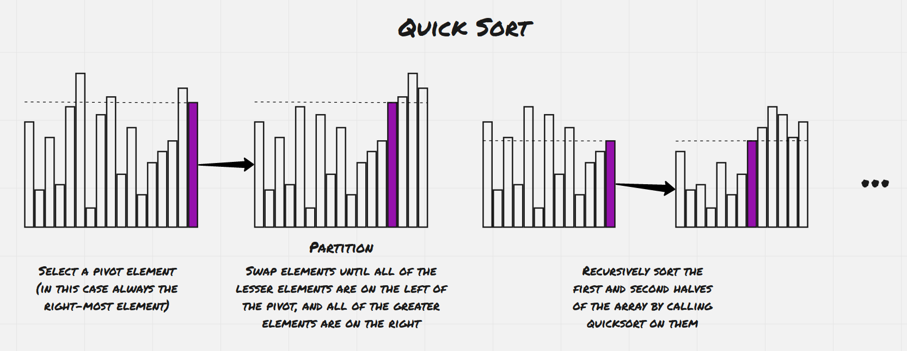
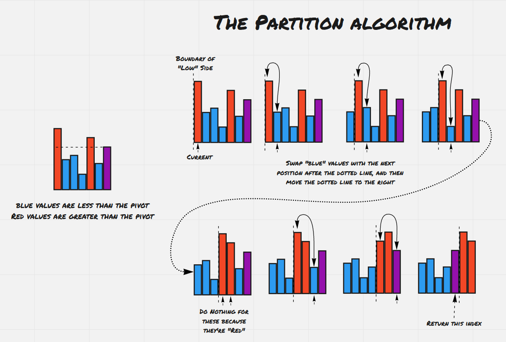

# Day 26: Insertion Sort

## Sorting

Sorting is a fundamental tasks in computer science. The idea is simple. We want to take a list of items that can be
compared, and produce a list of those same items in sorted order --- meaning every item in the list is no greater than
the next. Sorting can be done in-place on an array, meaning the original unsorted array is mutated and items are swapped
until that array is sorted. Sorting can also be done "out of place", meaning the original array is untouched and a new
sorted array is produced. This week we'll take a look at several basic sorting algorithms and investigate their
properties.

## The idea

Insertion sort is a basic and easy-to-understand algorithm for sorting an array. The idea is that we're sorting the list
in place from beginning to end. After the `i`th step, we want the first `i` elements of the list to be rearranged in
sorted order from the original order.

This means that at the beginning of the `i`th step, the first `i-1` elements should be the first `i-1` elements from the
original list in sorted order. At the end of the `i`th step, we'd like the first `i` elements to be in sorted order. We
can simply take the `i`th element and insert it into the first `i-1` elements of the array. All the elements less than
the `i`th element will remain untouched and all the elements greater than the `i`th will be shifted to the right to
accommodate the newly inserted element.

## An example

We're going to sort the list:

```
[5, 3, 2, 1, 4]
```

The first step involves sorting the sub-array containing the first element. We're already done! Any array with one
element is already sorted.

The second step involves sorting the sub-array containing the first 2 elements.

```
Step 2:
[5, 3, 2, 1, 4]
[3, 5, 2, 1, 4]
 **** <- the sorted part of the array
```

You can see that in step two we had to insert 3 before 5 and ended up with the first two elements sorted.

```
Step 3:
[3, 5, 2, 1, 4]
[2, 3, 5, 1, 4]
 *******
```

In step 3 we insert 2 in the beginning of the sub-array because it's less than both elements that have already been
sorted.

```
Step 4:
[2, 3, 5, 1, 4]
[1, 2, 3, 5, 4]
 **********
```

Then we move 1 to the beginning of the sub-array because it's less than all the other elements that have been sorted.
We've now sorted the first 4 elements of the array.

```
Step 5:
[2, 3, 5, 1, 4]
[1, 2, 3, 4, 5]
 *************
```

Finally, 4 is inserted before 5 and all of our array is sorted.

## The pseudo-pseudo code

From this example we can come up with an algorithm:

- For `i` from `1` through `n`, the length of the array:
    - Shift any element from the first `i-1` elements greater than the `i`th element one position to the right.
    - Insert the `i`th element into the first `i-i` elements in the left-most position where it isn't less than the
      element to its left.

## The pseudo-code

Note that in the above examples we've been referring to the `i`th element counting from the first. In the following
pseudocode the array is indexed from 0.

```
for i from 1 to n:
    j <- i - 1
    val <- array[i]
    while (j >= 0 and value < array[j]):
        array[j + 1] <- array[j]
        j <- j - 1
    array[j + 1] <- value
```

## Efficiency

In each step we need to insert an element into a sorted array, shifting everything greater than the element one to the
right. Inserting into an array is an ![O(n)][o-n] operation since some fraction of the list will have to be copied and
moved one position to the right. Since we're performing this operation once for every element in the list, our algorithm
runs in ![O(n^2)][nsquared] time.

## Can we do better?

As it turns out, we can sort better than ![O(n^2)][nsquared] An unsorted list with `n` unique elements can be thought of
as a permutation of the elements in the list. Sorting that list performs a unique sequence of steps for each
permutation `n` elements, since two different permutations need to be sorted differently to end up with a sorted list.
Since there are  permutations of `n` elements, we
need to perform enough comparisons to uniquely determine which of
the  permutations our list started out with.

How many comparisons is that? We can think of each comparison as dividing our set of possible permutations in half,
since our comparison has two possibilities. So performing `x` comparisons narrows our set of possible permutations down
by a factor of . That means we need to perform at
least `x` comparisons to sort a list of `n` elements, where `x` is the smallest number such
that . So intuitively, comparing the growth rate
of 
and  should tell us something about the growth rate
of the best possible sorting algorithm. It turns out that the solving the
equation  for `x` tells us that best possible
sorting algorithm can run no better than ![O(log n)][ologn]

(How do we do this? Take the logarithm of both sides and then
use [Stirling's Approximation](https://en.wikipedia.org/wiki/Stirling's_approximation) of the factorial function).

The point of all this mathematics is to demonstrate that no sorting algorithm can do better than ![O(log n)][ologn] We
say that this is a lower bound on the time efficiency of sorting. However, it doesn't actually demonstrate that such a
sorting algorithm exists. As it turns out, there are many algorithms that sort in ![O(log n)][ologn] time and later this
week we'll explore some of them.

# Day 27: Merge Sort

We've hinted that we can do better than ![O(n^2)][nsquared] for sorting. We've shown that our lower bound
is ![O(log n)][ologn] Today we'll focus on an algorithm that actually meets that lower bound. Intuitively we except
logarithms to show up in the time complexity when our problem can be broken down recursively in tree-like structures.
Merge sort is exactly a way to do that. We observe that two sorted lists can be merged into one in ![O(n)][o-n] time,
where `n` is the total number of elements from both lists. This suggests a recursive approach: sort the first half of
the list, then sort the second half of the list, then merge those halves together. We'll investigate this approach and
its efficiency.

## The merge

The simplest way to merge two arrays is as follows:

- Allocate a new array with size equal to the sum of the sizes of the input arrays
- Initialize indices `i`, `j`, and `k` as 0 to keep track of positions in the three arrays.
- Compare the values of the first array at `i` and the second array at `j`, and add the smaller of the two to the result
  array.
- When we've reached the end of either of the input arrays, add the remaining elements from the other array to the
  result array.

With this algorithm in hand, we can define our merge sort algorithm as follows:

- If an array is "small enough", it can be sorted using simple methods. For instance, an array of size 1 is always
  sorted. An array of size 2 can be sorted with a simple comparison.
- For an array with n elements, split the array into two subarrays with
  size  and
  size .
- Sort both of those arrays recursively.
- Merge the sorted arrays.
- Return the result.

## Efficiency

We'll analyze the efficiency of this simple merge sort algorithm in two different ways. First, imagine the recursive
calls of mergesort forming a tree of sub-problems, where the sub-problems are arrays to be sorted. Since each problem is
broken down into two sub-problems, this will be a binary tree. Every node in the tree will get called exactly once
during the execution of the algorithm. Consider the nodes from one level of the tree. The sum of the sizes of the arrays
from that level will be exactly `n`, the number of elements in the original array, because splitting an array up into
sub-arrays doesn't change the total number of elements. Finally, the tree will have ![log n][logn] levels, since each
level halves the sizes of the arrays.


Armed with these two facts, we can analyze the time and space efficiency of this algorithm from a top-down perspective.
Completing the sub-problems on each level takes a total of ![O(n)][o-n] time and space, since copying and merging arrays
are both linear in the total number of elements. Since there are ![log n][logn] levels, this gives us
the ![O(log n)][ologn] running time that we're looking for.

### The master theorem

There's another way to demonstrate the ![O(log n)][ologn]
running time of the merge sort algorithm. Recursive processes come up all the time in algorithms for various problems.
We can often express a relationship about the running time of an algorithm as an equation of the following form:

=aT\left(\frac{n}{b}\right)%2Bf(n)>)

We can imagine the >) term as
describing the time it takes to solve a number of sub-problems, and
the >) term as describing some amount of
additional overhead involved in breaking a problem up into sub-problems or combining those solutions into a master
solution.

The [master theorem](<https://en.wikipedia.org/wiki/Master_theorem_(analysis_of_algorithms)>) allows us to analyze an
algorithm whose running time satisfies a recurrence relation of the above form, given certain constraints on the values
of `a`, `b`, and `f(n)`. In our case we have
values 
, 
, and %2Dn>), which gives us the running time that
we're trying to demonstrate.

## A matter of space

One notable difference between our merge sort algorithm and our insertion sort algorithm is that our merge sort produces
a new sorted array and leaves the original array untouched, while our insertion sort modifies the array. This
duplication of space on each function call in total uses ![O(log n)][ologn] space. Can we do better?

Note that going from one level to the next we only need a total of ![O(n)][o-n] extra space. This suggests that we
should be able to come up with a merge sort algorithm that only uses ![O(n)][o-n] space while keeping the same time
complexity. This is left as an exercise to the reader. (Hint: allocate an array at the beginning of the same size as the
input array.)

# Day 27 bonus round: Heap sort

A write-up on [heap sort](heap-sort.md) using binary heaps.

# Day 28: Quick sort

Quicksort is another in-place sorting algorithm that has a ![O(n log n)][nlogn] running time. The idea is another
divide-and-conquer recursive style algorithm. We want to sort an array by breaking it down into sub-problems, solving
the sub-problems recursively, and then combining the solutions to the sub-problems into the master solution. In this
case, we'll divide up the problem into sub-problems by first partitioning the array into two sub-arrays, where every
element from one is smaller than every element from the other. We make sure that the partition with smaller numbers ends
up on the left and the partition with larger numbers ends up on the right. Then we can recursively sort these smaller
arrays. In this case since we're sorting the array in place, we don't have to do any work to combine the solutions to
the sub-problems. In this case, the work happens when we perform the partitioning of the array.



## The partitioning algorithm

We'll start with a basic partitioning algorithm. Pick the last item in the array as the pivot value. The rest of the
values in the array are either lower or higher than the pivot. (We'll include anything equal to the pivot in the low
set.) We're going to move everything lower than the pivot to the left side of the array, gradually growing our "low
section" as we encounter items that are smaller than the pivot. We'll keep a variable that indicates the boundary
between our "low section" and the rest of the array. This boundary initially starts out to the left of the array, since
our low section starts out empty.

We'll iterate through the array. Every time we encounter an item that's lower than the pivot, we'll swap it with the
item just to the right of our low section boundary, and then we'll move our low section boundary one position to the
right to indicate that we've added an element to the low section of our algorithm. Eventually we'll reach the last item
in our array, which is our pivot, and we'll swap that so that it's on the right side of our "low section". At this point
we end up with the pivot in between our lower and our high elements and then return the index of the pivot.



Since we're iterating through the array once, performing at most one comparison and one swap per iteration, this
partitioning algorithm ends up running in ![O(n)][o-n] time, where `n` is the size of the array that we're partitioning.

## The full quicksort algorithm

We'll present the pseudocode for the quicksort and the partition steps:

```pseudocode
Sorts an array between the indices start and end (not including the item at end)
quicksort(array, start, end):
    if start + 1 < array:
        middle <- partition(array, start, end)
        quicksort(array, start, middle)
        quicksort(array, middle + 1, end)

partition(array, start, end):
    pivot <- array[end - 1]
    low <- start
    for i in range [start .. end - 1]:
        if array[i] <= pivot:
            swap(array, i, low)
            low++
    return low - 1
```

## Efficiency

We can draw some analogies between the quicksort algorithm and the mergesort algorithm. They both perform solve the
problem with a divide-and-conquer strategy, splitting up the problem into sub-problems, solving the sub-problems, and
then combining the solutions to the sub-problems into the solution. With mergesort, splitting up the problem into
sub-problems just requires splitting the array in half down the middle. This can be done in constant time if we don't
copy the arrays into new arrays, and just change the indices that we are accessing the arrays with. However, merging the
two sorted arrays takes O(n) time since we need to traverse through both sorted lists to produce the merged list.

In constant, combining the two sub-problems in quick sort takes no time at all, since the arrays are sorted in place.
However, in quicksort the splitting actually takes up O(n) time, since we need to traverse the array to perform the
partition operation. However, both algorithms are able to divide and conquer with only O(n) overhead. According to our
master theorem, quicksort also takes O(n log n) time, as long as the problems are split in half on each recursion. This
suggests that there's a worst case scenario in the quicksort algorithm, where every step splits up the array into a very
small array and a very large array. In this case our tree becomes unbalanced, and instead of O(n log n), our algorithm
takes O(n^2). Note also that with our current implementation this happens exactly when we receive a mostly sorted list
as the input.

## Space

In the best case scenario, when the partitions are roughly equal in size on each step, our algorithm uses O(log n)
space, since every method call needs to be stored in the call stack. In the worst case scenario, our space requirement
becomes O(n), as our call stack grows linearly in the size of the array.

## Improvements

Receiving a mostly sorted list decreases our performance to the worst case O(n^2). However, on average our algorithm
runs in O(n log n) time. We want to ensure that our algorithm avoids this worst case scenario, most of the time. One
common way to do this is to choose a random pivot, instead of choosing the last element. This means that in the event
that we receive a mostly sorted list, our algorithm still splits the array roughly in half on each step.

Another common optimization is to switch from quicksort to insertion sort once we get to a small enough sub-array.
Insertion sort also sorts in place, and even though it runs in O(n^2) time, the additional overhead of using the call
stack makes insertion sort simpler and faster when the array is smaller than a certain threshold.


[constant]: <https://render.githubusercontent.com/render/math?math=O(1)>

[o-n]: <https://render.githubusercontent.com/render/math?math=O(n)>

[ologn]: <https://render.githubusercontent.com/render/math?math=O(\log%20n)>

[nlogn]: <https://render.githubusercontent.com/render/math?math=O(n\log%20n)>

[logn]: <https://render.githubusercontent.com/render/math?math=\log%20n>
