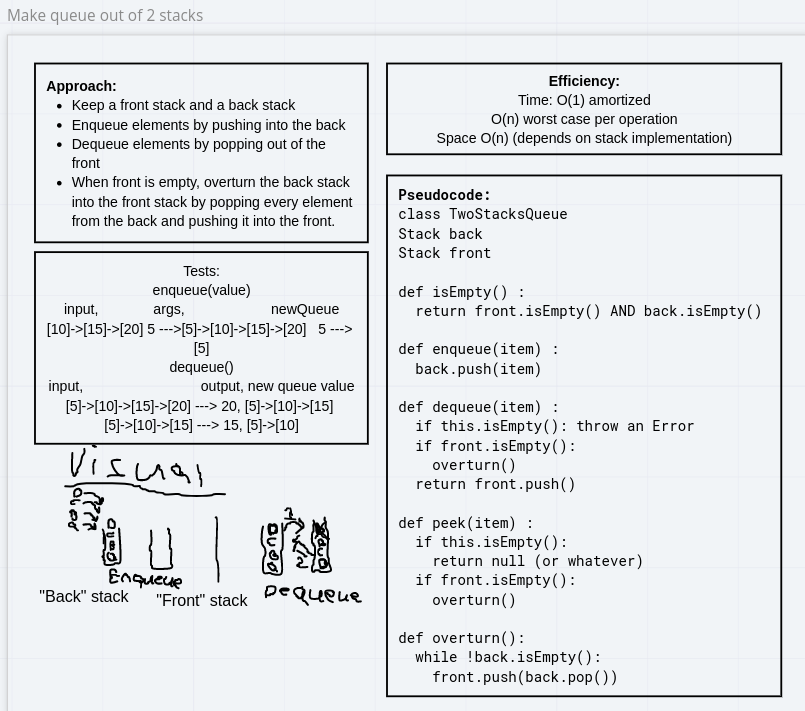
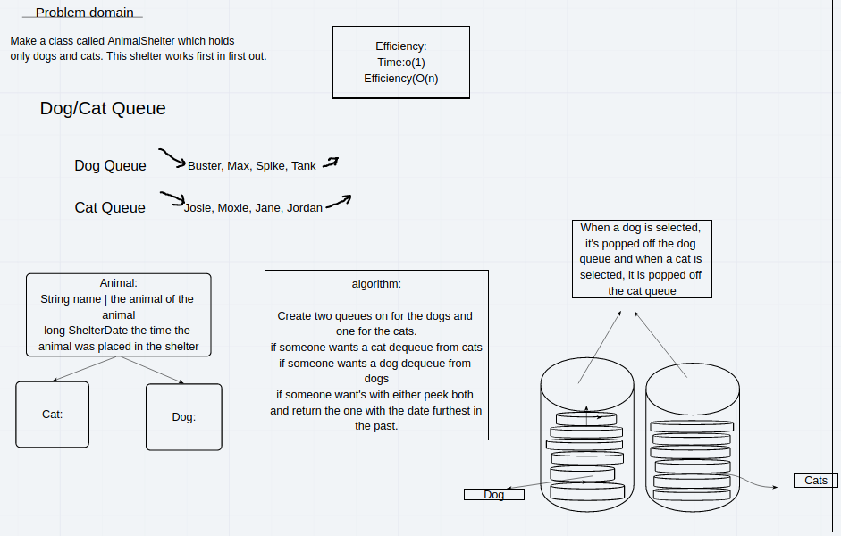

# Stacks and Queues implementations

In this lab we define the interface for a basic stack and queue abstract data type and write various implementations.
I've written more about the stack and queue [abstract data type](https://wordhou.github.io/reading-notes/adts.html) in
my reading notes.

# Lab 10: Linked list based implementations

We're asked to implement the stack and queue types using linked lists. I defined interfaces for both the queue and the
stack and them implemented them in
the [`LinkedListQueue<T>`](../challenges/lib/src/main/java/challenges/stacksQueues/LinkedListQueue.java) and
the [`LinkedListStack<T>`](../challenges/lib/src/main/java/challenges/stacksQueues/LinkedListStack.java) classes.

Interfaces are also defined for the [Queue](../challenges/lib/src/main/java/challenges/stacksQueues/Queue.java) and
the [Stack](../challenges/lib/src/main/java/challenges/stacksQueues/Stack.java).

## Approach and Efficiency

No whiteboard is done for today's lab since I've already implemented the singly linked list in detail in previous labs.

The one consideration to make is which linked-list operations to use to implement the stack and queue operations. For
the stack, since we have O(1) operations at the head of the list, we push and pop by adding and removing elements from
the head of the list. For the queue, we want to add on one end of the list and remove from the other end. Since we have
O(n) removal from the tail of the list but O(1) addition to the tail, it's natural to add elements to the tail of the
list and remove them from the head so that both of our operations are constant time.

## Extra

I also implemented a fixed-sized circular buffer using an array. This models a queue with a fixed capacity that rejects
additions after it's reached capacity. The interface for this is defined
in [BoundedQueue<T>](../challenges/lib/src/main/java/challenges/stacksQueues/BoundedQueue.java) and the implementation
is defined in [CircularBuffer<T>](../challenges/lib/src/main/java/challenges/stacksQueues/CircularBuffer.java).

# Lab 11: Implementing a queue with two stacks

We're asked to solve the classic problem of implementing a queue with two stacks.

## Approach and Efficiency

The solution keeps two stacks, `back` and `front`. In a queue, the convention is that elements are added at the back of
the line and come out of the front of the line. Similarly, elements are added into the back stack and popped out of the
front stack. Whenever the front stack is empty, we "overturn" the back stack into the front stack by popping every
element from the back and pushing it into the front. Since the elements in the `back` stack come out in LIFO order, and
then come out of the `front` stack in LIFO order, the order gets flipped twice and elements come out of the two stacks
in the same order they arrived in.

The time efficiency here is `O(1)` amortized, but `O(n)` for any individual `pop` or `peek` operation. To perform `n`
pop operations with any number of pushes or peeks, we may need to overturn the stack any number of times, which
is `O(n)` in the current number of elements in the back stack. However, over those `n` operations we are pushing and
popping each item at most once, so performing n pops runs in `O(n)` times, and `pop` runs in average O(1) time.

## Solution



My code for the two stacks queue can be
found [here](../challenges/lib/src/main/java/challenges/stacksQueues/TwoStacksQueue.java). One note is that
our `TwoStacksQueue` is generic both on the type of item that it stores, and also generic on the stack implementation
that it uses. However, to achieve this polymorphism on the stack implementation, we need to pass the constructor of the
stack implementation into the constructor of `TwoStacksQueue`. Our class `TwoStacksQueue<T, S extends Stack<T>>` is
instantiated as follows:

```java
TwoStacksQueue<Integer, StackImplementation<Integer>>=new TwoStacksQueue(StackImplementation<Integer>::new)
```

# Lab 11: A queue on two types

The challenge asks us to construct a queue for animals of two different types: cats, and dogs. The queue has custom
dequeue commands that allow a user to request an animal of a certain type. If there is an animal of that type, the one
that has been in the shelter comes out first (FIFO order). The shelter also implements a `dequeue` which doesn't specify
an animal type, which returns the animal that has been in the shelter the longest.

## Approach and Efficiency

This was implemented using two queues, one for cats and one for dogs. The Animal objects are also wrapped in a wrapper
object that keeps track of the order in which the animals were enqueued into the shelter. Then in order to dequeue a
specific animal type, we just dequeue from the queue for that animal type. To get the animal that's been in the shelter
the longest, we peek at both queues to determine which one has the animal that's been in the shelter the longest.

The efficiency of this solution is O(1) time for all operations, assuming we are using a O(1) queue implementation.

## Solution



The solution was to keep two queues and also to "timestamp" each animal as it's entered into the shelter. The code for
this solution can be found
in [AnimalShelter.java](../challenges/lib/src/main/java/challenges/animalShelter/AnimalShelter.java).

I also generalized the solution to a general typed queue on multiple classes.
The [TypedQueue](../challenges/lib/src/main/java/challenges/animalShelter/TypedQueue.java) class constructor takes as
its only input an array of classes, and then the structure accepts any object that's in that array of classes.
